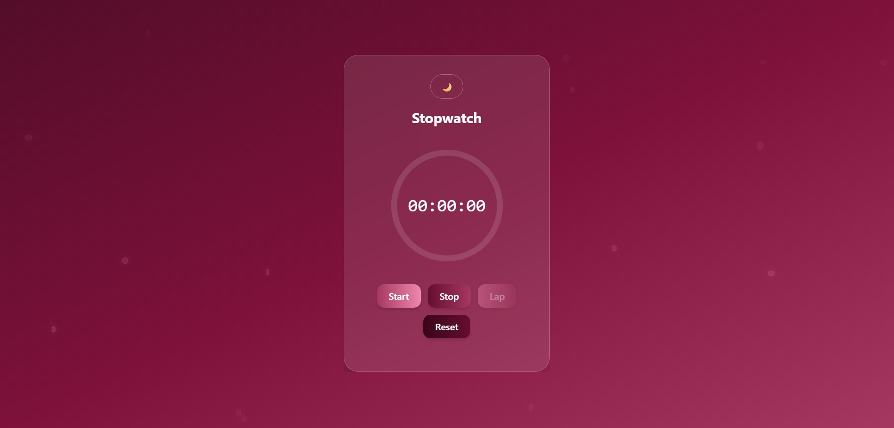

# ⏱️ Aesthetic Stopwatch Web App

A modern, interactive and fully responsive stopwatch web application built using React and Tailwind CSS.  
This project focuses on UI/UX design, smooth animations, and real-world stopwatch functionality.

---

## 🌐 Live Demo
👉 https://beamish-gelato-5d5823.netlify.app/
 


---
## 🚀 Features

- ⏱️ Accurate stopwatch with milliseconds precision
- ▶️ Start / Pause / Reset functionality
- 🏁 Lap recording system
- ⚡ Fastest lap highlight
- 🐢 Slowest lap highlight
- 💾 Persistent lap storage using localStorage
- 🌗 Dark / Light mode toggle
- 🎯 Auto-scroll to latest lap
- 🎨 Glassmorphism UI design
- 🌊 Animated background bubbles
- 📱 Fully responsive design (mobile + desktop)

---

## 🛠️ Tech Stack

- React.js
- Vite
- Tailwind CSS
- JavaScript (ES6+)
- HTML5

---

## 📂 Project Structure
src/
│── Stopwatch.jsx
├── assets/
├── App.jsx
├── main.jsx


---

## ⚙️ Installation & Setup

```bash
# Clone repository
git clone https://github.com/Saniya-usman/Stop-watch-app.git

# Navigate to project
cd stopwatch-app

# Install dependencies
npm install

# Run development server
npm run dev

💡 What I Learned
Advanced state management using React hooks
Real-time interval handling with useRef
UI design using Tailwind CSS
Data persistence using localStorage
Creating responsive and animated UI components
Improving user experience with micro-interactions

🎯 Future Improvements
Sound effects for start/stop/lap
Vibration support for mobile
Export lap data
PWA support (installable app)
Analytics dashboard for laps

Author

Saniya Bammanalli
Frontend Developer | CSE Student

📧 Email: saniyabammnalli@gmail.com

🔗 GitHub: https://github.com/Saniya-usman

🔗 LinkedIn: https://www.linkedin.com/in/saniya-bammanalli-ab6b78334/

If you like this project, consider giving it a ⭐ on GitHub!